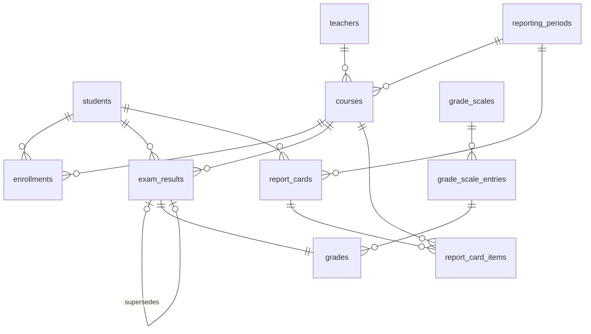
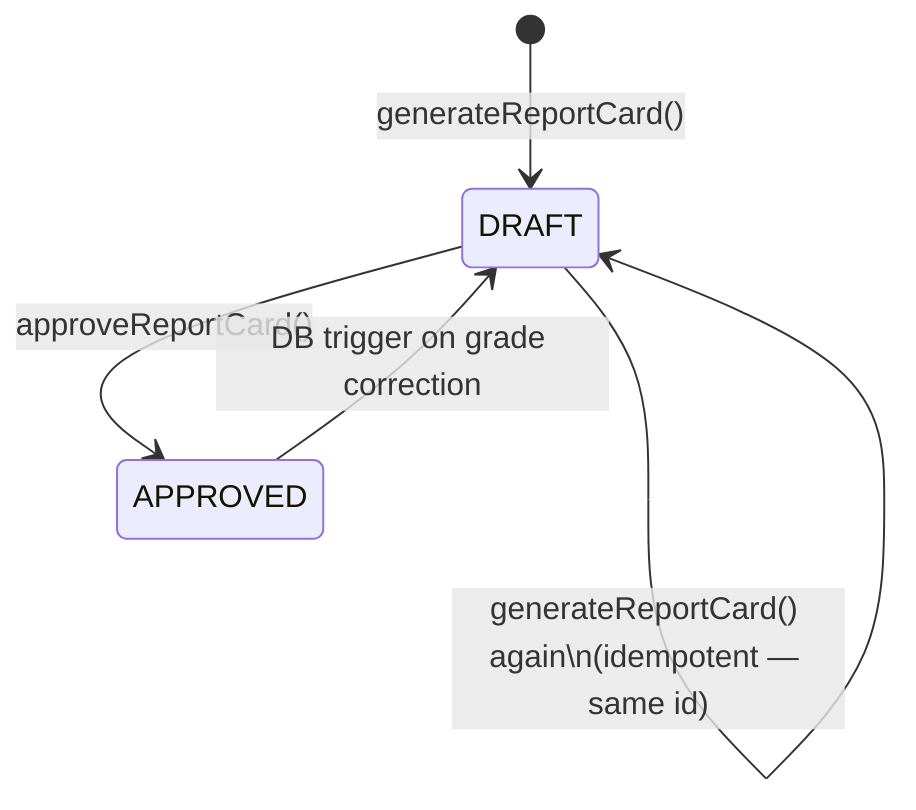

# School Management Portal — Database & Results Domain

> Feature branch: `001-database-results-baseline` | Java 17 · Spring Boot 3 · PostgreSQL 15 · Flyway 10

---

## What This Module Does

This module owns the **Database & Results domain** of the School Management Portal. It provides:

- **Schema management** via versioned Flyway migrations (PostgreSQL 15+)
- **Grade scale configuration** — score-boundary-to-letter-grade reference tables
- **Exam result recording** — append-only, immutable, fully audited score entries
- **Grade resolution** — mapping raw scores to letter grades via the active scale
- **Aggregate computation** — per-student averages and class rankings via PostgreSQL materialized views
- **Report card generation** — deterministic, per-student, per-period summaries with DRAFT/APPROVED lifecycle

Authentication, PDF/HTML rendering, and academic calendar management are owned by separate modules.

---

## Quick Start

**Prerequisites**: Java 17, Maven 3.9+, Docker 24+

```bash
# 1. Start local PostgreSQL
docker compose up -d db

# 2. Run the application (Flyway migrations run automatically)
./mvnw spring-boot:run -Dspring-boot.run.profiles=local
# → Application starts on http://localhost:8080

# 3. Run full test suite (requires Docker running)
./mvnw verify
```

---

## Technology Stack

| | |
|---|---|
| Language | Java 17 |
| Framework | Spring Boot 3.x |
| ORM | Spring Data JPA / Hibernate 6.x |
| Database | PostgreSQL 15+ |
| Migrations | Flyway 10.x |
| DTO Mapping | MapStruct (compile-time) |
| Testing | JUnit 5 + Mockito + Testcontainers |

---

## Project Structure

```
src/main/java/com/school/portal/
├── controller/          # REST endpoints
├── service/             # Business logic + transaction boundaries
├── repository/          # Spring Data JPA interfaces + native queries
├── domain/
│   ├── entity/          # JPA entities (11 classes)
│   └── enums/           # EnrollmentStatus, ReportCardStatus
├── dto/                 # DTOs + MapStruct mappers
└── exception/           # Domain exceptions + GlobalExceptionHandler

src/main/resources/db/migration/
├── V1__create_core_tables.sql
├── V2__create_grade_scale_tables.sql
├── V3__create_exam_results.sql
├── V4__create_grades.sql
├── V5__create_report_cards.sql
├── V6__add_sort_priority_to_grade_scale_entries.sql
├── R__create_views.sql      # v_active_exam_results, mv_course_aggregates, v_student_period_summary
└── R__create_triggers.sql   # trg_revert_report_card_on_correction
```

---

## REST API Summary

| Method | Path | Description |
|---|---|---|
| `GET` | `/api/v1/grade-scales` | List active grade scales |
| `POST` | `/api/v1/grade-scales` | Create grade scale (ADMIN) |
| `DELETE` | `/api/v1/grade-scales/{id}` | Delete grade scale (ADMIN) |
| `POST` | `/api/v1/results` | Submit exam result |
| `POST` | `/api/v1/results/{id}/correct` | Submit grade correction |
| `GET` | `/api/v1/results` | Query active results (paginated) |
| `GET` | `/api/v1/results/aggregates` | Get class aggregates |
| `POST` | `/api/v1/results/aggregates/refresh` | Refresh materialized view (ADMIN) |
| `POST` | `/api/v1/report-cards/generate` | Generate report card (idempotent) |
| `POST` | `/api/v1/report-cards/{id}/approve` | Approve report card |
| `GET` | `/api/v1/report-cards/{id}` | Get report card by ID |
| `GET` | `/api/v1/report-cards` | List report cards (paginated) |

---

## Key Design Invariants

1. **No floating-point scores** — all score columns are `NUMERIC(5,2)`
2. **Exam results are immutable** — corrections create new rows via `supersedes_id`; originals are never modified
3. **Aggregates come from the DB** — `mv_course_aggregates` materialized view; no application-layer re-computation
4. **Report cards use DTOs only** — the rendering layer receives `ReportCardDTO`; it never queries the database
5. **No H2 in tests** — all integration tests use real PostgreSQL via Testcontainers
6. **All FK columns are indexed**
7. **Never edit a committed `V__` migration** — create a new `V{n+1}` instead

---

## Data Model



---

## Report Card Lifecycle



---

## Testing

| Test type | Technology | DB |
|---|---|---|
| Entity constraint unit tests | JUnit 5 | None |
| Repository integration | `@DataJpaTest` + Testcontainers | Real PostgreSQL |
| Service unit | JUnit 5 + Mockito | Mocked |
| Service integration | `@SpringBootTest` + Testcontainers | Real PostgreSQL |
| Controller integration | `@SpringBootTest` + Testcontainers | Real PostgreSQL |

Coverage requirement: **repository and service layers ≥ 80%** (enforced in CI).

---

## Schema Migration Workflow

1. Write `V{n+1}__description.sql` under `src/main/resources/db/migration/`
2. Test against clean Docker DB: `docker compose up -d db` → `./mvnw flyway:migrate`
3. Regenerate ERD (see `docs/erd/v1/migration-runbook.md`)
4. Update JPA entity for the new column
5. Run `./mvnw verify` — all tests must pass, coverage ≥ 80%
6. Open PR including migration + ERD diff + entity update

---

## Documentation

Detailed documentation is available in [`docs/summary/`](docs/summary/):

| File | Content |
|---|---|
| [`index.md`](docs/summary/index.md) | Navigation guide for this documentation set |
| [`architecture.md`](docs/summary/architecture.md) | Layered architecture, key design decisions |
| [`components.md`](docs/summary/components.md) | All classes, their responsibilities, and key methods |
| [`interfaces.md`](docs/summary/interfaces.md) | REST API contracts with full request/response shapes |
| [`data_models.md`](docs/summary/data_models.md) | All tables, views, triggers, constraints |
| [`workflows.md`](docs/summary/workflows.md) | End-to-end flows with sequence diagrams |
| [`dependencies.md`](docs/summary/dependencies.md) | Libraries and rationale |

PlantUML diagram sources: [`docs/plantuml/`](docs/plantuml/)
ERD and migration runbook: [`docs/erd/v1/`](docs/erd/v1/)
Feature specification: [`specs/001-database-results-baseline/`](specs/001-database-results-baseline/)
