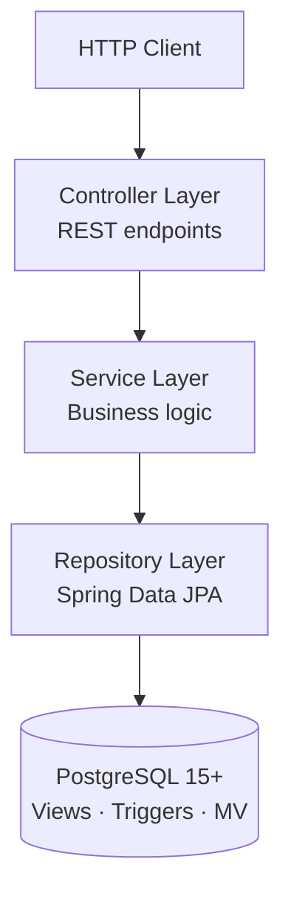
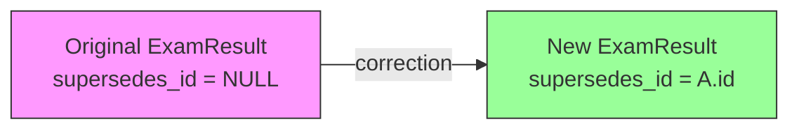
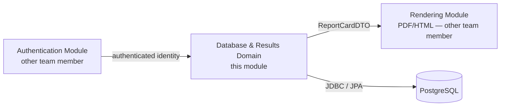

# Architecture — School Management Portal (Database & Results Domain)

---

## Architectural Style

The system follows a **classic layered architecture** within a single Spring Boot module:

Each layer has a strict contract with the layer below it — no layer skips another. Controllers never call repositories directly. Services never expose JPA entities beyond the service boundary; they return DTOs.

---

## Layer Responsibilities

| Layer | Package | Responsibility |
|---|---|---|
| Controller | `controller/` | HTTP routing, request deserialization, response serialization. No business logic. |
| Service | `service/` | All business rules: validation, orchestration, transaction boundaries. Returns DTOs. |
| Repository | `repository/` | Spring Data JPA interfaces. Native queries where view/materialized view access is needed. |
| Domain | `domain/entity/`, `domain/enums/` | JPA entity definitions. No business logic, only structural constraints. |
| DTO | `dto/` | Data transfer objects + MapStruct mappers. Crossed the service → controller and service → rendering module boundaries. |
| Exception | `exception/` | Domain-specific exceptions + `GlobalExceptionHandler` mapping them to HTTP status codes. |

---

## Key Architectural Decisions

### 1. Schema-First with Flyway

All schema changes flow through versioned Flyway migration scripts. JPA is configured with `spring.jpa.ddl-auto=validate` — it validates entities against the schema but never generates DDL. This means the database is always the source of truth.

**Consequence**: Adding a column requires a `V{n+1}__` migration *before* updating the entity.

### 2. Immutable Exam Results (Append-Only Corrections)

Original records are never updated or deleted. A correction inserts a new row referencing the original via `supersedes_id`. The view `v_active_exam_results` filters to rows that are not referenced by any newer correction — this is the only view all downstream consumers should use.

### 3. Aggregates from the Database Layer

Per-student averages and class rankings are computed entirely in PostgreSQL:

- `mv_course_aggregates` — materialized view, refreshed explicitly after grade-entry batches.
- `v_student_period_summary` — regular view joining enrollments, course aggregates, and grades.

Application-layer re-implementation of the same arithmetic is explicitly forbidden (FR-013).

### 4. DTO Boundary at the Service Layer

JPA entities never leave the service layer. The rendering module (owned by another team member) receives `ReportCardDTO` exclusively and must not query the database. This prevents `LazyInitializationException` issues and decouples the persistence model from the rendering contract.

### 5. DB Trigger for Report Card Auto-Revert

When a grade correction is inserted into `exam_results` and a related `APPROVED` report card exists for that student and period, a PostgreSQL trigger (`trg_revert_report_card_on_correction`) automatically sets `report_cards.status = 'DRAFT'`. This keeps the report card lifecycle consistent without requiring application-layer polling or event infrastructure.

### 6. Idempotent Report Card Generation

The `UNIQUE` constraint on `(student_id, reporting_period_id)` in `report_cards` is the database-level guard against duplicate generation. The service layer checks for an existing `DRAFT` before inserting; if one exists, it is returned unchanged. This means calling `generateReportCard` twice with the same arguments always returns the same `id`.

---

## Cross-Cutting Concerns

### Auditing

`JpaConfig.java` enables Spring Data JPA Auditing (`@EnableJpaAuditing`). An `AuditorAware` bean reads the identity from the security context. Entities annotated with `@CreatedBy` / `@LastModifiedBy` / `@CreatedDate` / `@LastModifiedDate` are populated automatically on every write.

### Exception Handling

`GlobalExceptionHandler` (`@RestControllerAdvice`) centralises all HTTP error responses. Domain exceptions map to:

| Exception | HTTP Status |
|---|---|
| `ResourceNotFoundException` | 404 |
| `BusinessRuleViolationException` | 422 |
| `ClosedPeriodException` | 409 |
| `DuplicateReportCardException` | 409 |
| `IllegalStateException` | 409 |
| Bean Validation failure | 400 |
| Constraint violation (DB) | 409 |

### Transaction Boundaries

All write operations in service methods are annotated `@Transactional`. Read-only operations use `@Transactional(readOnly = true)`. Controllers are not transactional.

---

## Module Boundaries

This module **consumes** an authenticated identity context. It **produces** `ReportCardDTO` for the rendering module. It does not own authentication, PDF generation, or calendar management.
