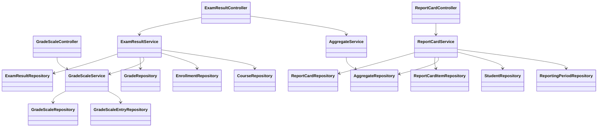

# Components — School Management Portal (Database & Results Domain)

---

## Component Map

---

## Controllers

### `GradeScaleController`
**Package**: `controller/`
**Routes**: `GET /api/v1/grade-scales`, `POST /api/v1/grade-scales`, `DELETE /api/v1/grade-scales/{id}`
**Delegates to**: `GradeScaleService`

### `ExamResultController`
**Package**: `controller/`
**Routes**: `POST /api/v1/results`, `POST /api/v1/results/{id}/correct`, `GET /api/v1/results`, `GET /api/v1/results/aggregates`, `POST /api/v1/results/aggregates/refresh`
**Delegates to**: `ExamResultService`, `AggregateService`

### `ReportCardController`
**Package**: `controller/`
**Routes**: `POST /api/v1/report-cards/generate`, `POST /api/v1/report-cards/{id}/approve`, `GET /api/v1/report-cards/{id}`, `GET /api/v1/report-cards`
**Delegates to**: `ReportCardService`

---

## Services

### `GradeScaleService`
**Package**: `service/`

| Method | Description |
|---|---|
| `createGradeScale(request)` | Validates non-overlapping entries, persists `GradeScale` + entries |
| `listActiveScales()` | Returns all scales with `is_active = true` |
| `deleteGradeScale(id)` | Guards against deletion when referenced by `grades`; throws `BusinessRuleViolationException` |
| `resolveLetterGrade(scaleId, rawScore)` | Looks up matching `GradeScaleEntry`; returns `"UNGRADED"` if none matches |
| `resolveEntry(scaleId, rawScore)` | Returns the matching `GradeScaleEntry` entity |
| `validateEntries(entries)` | Checks for overlapping or gap-containing score ranges |

### `ExamResultService`
**Package**: `service/`

| Method | Description |
|---|---|
| `submitResult(request, submittedBy)` | Validates enrollment + open period + score range; persists `ExamResult`; resolves and persists `Grade` |
| `correctResult(originalId, request, correctedBy)` | Loads original; inserts correction row with `supersedes_id`; re-resolves `Grade` |
| `queryResults(filter, pageable)` | Queries `v_active_exam_results` via repository; returns paginated `ExamResultDTO` list |
| `validateEnrollment(studentId, courseId)` | Throws `BusinessRuleViolationException` if student not enrolled |
| `validatePeriodOpen(courseId)` | Throws `ClosedPeriodException` if `grade_submission_close` is in the past |
| `validateScoreRange(rawScore, maxScore)` | Throws `BusinessRuleViolationException` if `rawScore > maxScore` or `< 0` |
| `resolveAndPersistGrade(examResult)` | Calls `GradeScaleService`, creates and saves `Grade` |

### `AggregateService`
**Package**: `service/`

| Method | Description |
|---|---|
| `getCourseAggregates(courseId)` | Reads `mv_course_aggregates` + `mv_refresh_log`; returns `CourseAggregateDTO` |
| `refreshAggregates(refreshedBy)` | Calls `REFRESH MATERIALIZED VIEW CONCURRENTLY mv_course_aggregates`; updates `mv_refresh_log`; returns `AggregateRefreshDTO` |

### `ReportCardService`
**Package**: `service/`

| Method | Description |
|---|---|
| `generateReportCard(studentId, periodId, generatedBy)` | Idempotent — returns existing DRAFT if unchanged; otherwise reads `v_student_period_summary`, builds and persists `ReportCard` + items |
| `approveReportCard(id, approvedBy)` | Transitions `DRAFT → APPROVED`; throws `IllegalStateException` if already approved |
| `getReportCard(id)` | Fetches by ID; throws `ResourceNotFoundException` if missing |
| `listReportCards(studentId, periodId, status, pageable)` | Filtered list query |

---

## Repositories

### Standard Spring Data Interfaces

| Repository | Notable Custom Queries |
|---|---|
| `StudentRepository` | `findByStudentNumber`, `existsByStudentNumber` |
| `TeacherRepository` | `findByEmployeeNumber` |
| `ReportingPeriodRepository` | `findByNameAndAcademicYear` |
| `CourseRepository` | `findByTeacherId`, `findByReportingPeriodId` |
| `EnrollmentRepository` | `existsByStudentIdAndCourseIdAndStatus`, `findByStudentIdAndCourseId` |
| `GradeScaleRepository` | `findByActiveTrue`, `findByName`, `existsByName` |
| `GradeScaleEntryRepository` | `findMatchingEntry(scaleId, score)`, `isReferencedByGrades(entryId)`, `findByGradeScaleIdOrderByMinScoreDesc` |
| `ExamResultRepository` | `findActiveByStudentAndCourse`, `existsActiveByStudentCourseAndExam`, `findSupersededChain(id)`, `findActiveResults` |
| `GradeRepository` | `findByExamResultId` |
| `ReportCardRepository` | `findByStudentIdAndReportingPeriodId`, `existsByStudentIdAndReportingPeriodIdAndStatus`, `findByStudentId` |
| `ReportCardItemRepository` | `findByReportCardId` |

### `AggregateRepository` (class, not interface)
Uses `EntityManager` / native SQL to:
- `refreshMaterializedView()` — executes `REFRESH MATERIALIZED VIEW CONCURRENTLY mv_course_aggregates`
- `findCourseAggregates(courseId)` — reads from `mv_course_aggregates`
- `findLastRefreshedAt(viewName)` — reads from `mv_refresh_log`
- `recordRefresh(viewName, refreshedBy)` — inserts/updates `mv_refresh_log`
- `findClassAverage(courseId)`, `countStudentsInCourse(courseId)` — summary queries

---

## Domain Entities

| Entity | Business Key | Table |
|---|---|---|
| `Student` | `studentNumber` | `students` |
| `Teacher` | `employeeNumber` | `teachers` |
| `ReportingPeriod` | `(name, academicYear)` | `reporting_periods` |
| `Course` | `(courseCode, reportingPeriod)` | `courses` |
| `Enrollment` | `(student, course)` | `enrollments` |
| `GradeScale` | `name` | `grade_scales` |
| `GradeScaleEntry` | `(gradeScale, letterGrade)` | `grade_scale_entries` |
| `ExamResult` | `(student, course, examName, createdAt)` | `exam_results` |
| `Grade` | `examResult` | `grades` |
| `ReportCard` | `(student, reportingPeriod)` | `report_cards` |
| `ReportCardItem` | `(reportCard, course)` | `report_card_items` |

All entities implement `equals()`/`hashCode()` based on business key (never `id`). All JPA relationships use `FetchType.LAZY`.

---

## DTOs and Mappers

| DTO | Produced by | Consumed by |
|---|---|---|
| `GradeScaleDTO` + `GradeScaleEntryDTO` | `GradeScaleMapper` | `GradeScaleController` |
| `ExamResultDTO` | `ExamResultMapper` | `ExamResultController`, API consumers |
| `CourseAggregateDTO` + `StudentRankingDTO` | `AggregateService` | `ExamResultController` |
| `AggregateRefreshDTO` | `AggregateService` | `ExamResultController` |
| `ReportCardDTO` (+ `StudentSummaryDTO`, `ReportingPeriodSummaryDTO`, `CourseResultDTO`) | `ReportCardMapper` | `ReportCardController`, **rendering module** |

---

## Exceptions

| Class | Thrown when | HTTP code |
|---|---|---|
| `ResourceNotFoundException` | Entity not found by ID | 404 |
| `BusinessRuleViolationException` | Business rule broken (unenrolled student, bad score range, etc.) | 422 |
| `ClosedPeriodException` | Grade submitted after `grade_submission_close` | 409 |
| `DuplicateReportCardException` | Concurrent duplicate report card insert | 409 |
| `GlobalExceptionHandler` | Catches all of the above + validation + DB constraint violations | — |

---

## Configuration

### `JpaConfig`
- Enables `@EnableJpaAuditing`
- Provides `AuditorAware` bean reading identity from Spring Security context
- Used by `@CreatedBy` / `@LastModifiedBy` fields on audited entities
