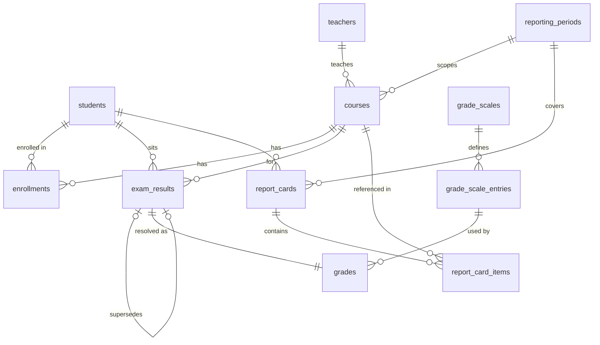

# Data Models — School Management Portal (Database & Results Domain)

---

## Entity Relationship Overview



---

## Tables

### `students`

| Column | Type | Constraints |
|---|---|---|
| `id` | `BIGSERIAL` | PK |
| `student_number` | `VARCHAR(20)` | UNIQUE NOT NULL |
| `first_name` | `VARCHAR(100)` | NOT NULL |
| `last_name` | `VARCHAR(100)` | NOT NULL |
| `date_of_birth` | `DATE` | NOT NULL |
| `email` | `VARCHAR(255)` | UNIQUE NOT NULL |
| `created_at` | `TIMESTAMPTZ` | NOT NULL DEFAULT now() |
| `updated_at` | `TIMESTAMPTZ` | NOT NULL DEFAULT now() |

**JPA entity**: `Student` | **Business key**: `studentNumber`

---

### `teachers`

| Column | Type | Constraints |
|---|---|---|
| `id` | `BIGSERIAL` | PK |
| `employee_number` | `VARCHAR(20)` | UNIQUE NOT NULL |
| `first_name` | `VARCHAR(100)` | NOT NULL |
| `last_name` | `VARCHAR(100)` | NOT NULL |
| `email` | `VARCHAR(255)` | UNIQUE NOT NULL |
| `created_at` | `TIMESTAMPTZ` | NOT NULL DEFAULT now() |
| `updated_at` | `TIMESTAMPTZ` | NOT NULL DEFAULT now() |

**JPA entity**: `Teacher` | **Business key**: `employeeNumber`

---

### `reporting_periods`

| Column | Type | Constraints |
|---|---|---|
| `id` | `BIGSERIAL` | PK |
| `name` | `VARCHAR(100)` | NOT NULL |
| `academic_year` | `VARCHAR(9)` | NOT NULL |
| `start_date` | `DATE` | NOT NULL |
| `end_date` | `DATE` | NOT NULL |
| `grade_submission_close` | `TIMESTAMPTZ` | NOT NULL |
| `is_active` | `BOOLEAN` | NOT NULL DEFAULT true |
| `created_at` | `TIMESTAMPTZ` | NOT NULL DEFAULT now() |

**Unique**: `(name, academic_year)` | **Check**: `end_date > start_date`; `grade_submission_close >= end_date`
**JPA entity**: `ReportingPeriod` | **Business key**: `(name, academicYear)`

---

### `courses`

| Column | Type | Constraints |
|---|---|---|
| `id` | `BIGSERIAL` | PK |
| `course_code` | `VARCHAR(20)` | NOT NULL |
| `course_name` | `VARCHAR(200)` | NOT NULL |
| `reporting_period_id` | `BIGINT` | FK → `reporting_periods.id` NOT NULL |
| `teacher_id` | `BIGINT` | FK → `teachers.id` NOT NULL |
| `max_score` | `NUMERIC(5,2)` | NOT NULL DEFAULT 100.00 |
| `created_at` | `TIMESTAMPTZ` | NOT NULL DEFAULT now() |
| `updated_at` | `TIMESTAMPTZ` | NOT NULL DEFAULT now() |

**Unique**: `(course_code, reporting_period_id)` | **Check**: `max_score > 0`
**Indexes**: `idx_courses_reporting_period_id`, `idx_courses_teacher_id`
**JPA entity**: `Course` | **Business key**: `(courseCode, reportingPeriod)`

---

### `enrollments`

| Column | Type | Constraints |
|---|---|---|
| `id` | `BIGSERIAL` | PK |
| `student_id` | `BIGINT` | FK → `students.id` NOT NULL |
| `course_id` | `BIGINT` | FK → `courses.id` NOT NULL |
| `status` | `VARCHAR(20)` | NOT NULL DEFAULT 'ACTIVE' |
| `enrolled_at` | `TIMESTAMPTZ` | NOT NULL DEFAULT now() |

**Unique**: `(student_id, course_id)`
**Indexes**: `idx_enrollments_student_id`, `idx_enrollments_course_id`
**JPA entity**: `Enrollment` | **Business key**: `(student, course)` | **Enum**: `EnrollmentStatus { ACTIVE, WITHDRAWN }`

---

### `grade_scales`

| Column | Type | Constraints |
|---|---|---|
| `id` | `BIGSERIAL` | PK |
| `name` | `VARCHAR(100)` | UNIQUE NOT NULL |
| `description` | `VARCHAR(500)` | NULL |
| `is_active` | `BOOLEAN` | NOT NULL DEFAULT true |
| `created_at` | `TIMESTAMPTZ` | NOT NULL DEFAULT now() |
| `created_by` | `VARCHAR(100)` | NOT NULL |

**JPA entity**: `GradeScale` | **Business key**: `name`

---

### `grade_scale_entries`

| Column | Type | Constraints |
|---|---|---|
| `id` | `BIGSERIAL` | PK |
| `grade_scale_id` | `BIGINT` | FK → `grade_scales.id` NOT NULL |
| `letter_grade` | `VARCHAR(5)` | NOT NULL |
| `min_score` | `NUMERIC(5,2)` | NOT NULL |
| `max_score` | `NUMERIC(5,2)` | NOT NULL |
| `grade_points` | `NUMERIC(3,2)` | NOT NULL |
| `pass_indicator` | `BOOLEAN` | NOT NULL DEFAULT true |
| `display_order` | `INTEGER` | NOT NULL DEFAULT 0 |
| `sort_priority` | `INTEGER` | NOT NULL DEFAULT 0 |

**Unique**: `(grade_scale_id, letter_grade)` | **Check**: `max_score > min_score`
**Index**: `idx_grade_scale_entries_grade_scale_id`
**JPA entity**: `GradeScaleEntry` | **Business key**: `(gradeScale, letterGrade)`

---

### `exam_results`

**Append-only.** Corrections insert new rows via `supersedes_id`.

| Column | Type | Constraints |
|---|---|---|
| `id` | `BIGSERIAL` | PK |
| `student_id` | `BIGINT` | FK → `students.id` NOT NULL |
| `course_id` | `BIGINT` | FK → `courses.id` NOT NULL |
| `exam_name` | `VARCHAR(200)` | NOT NULL |
| `raw_score` | `NUMERIC(5,2)` | NOT NULL |
| `max_score` | `NUMERIC(5,2)` | NOT NULL |
| `supersedes_id` | `BIGINT` | FK → `exam_results.id` NULL |
| `created_at` | `TIMESTAMPTZ` | NOT NULL DEFAULT now() |
| `updated_at` | `TIMESTAMPTZ` | NOT NULL DEFAULT now() |
| `created_by` | `VARCHAR(100)` | NOT NULL |

**Checks**: `raw_score >= 0`; `raw_score <= max_score`; `supersedes_id <> id`
**Indexes**: `idx_exam_results_student_id`, `idx_exam_results_course_id`, `idx_exam_results_supersedes_id`
**JPA entity**: `ExamResult` | **Business key**: `(student, course, examName, createdAt)`

**Active row definition**: A row is "active" when no other row has `supersedes_id = this.id`.

---

### `grades`

One resolved letter grade per `exam_result`. Snapshots the letter grade and grade points at resolution time.

| Column | Type | Constraints |
|---|---|---|
| `id` | `BIGSERIAL` | PK |
| `exam_result_id` | `BIGINT` | FK → `exam_results.id` UNIQUE NOT NULL |
| `grade_scale_entry_id` | `BIGINT` | FK → `grade_scale_entries.id` NOT NULL |
| `letter_grade` | `VARCHAR(5)` | NOT NULL |
| `grade_points` | `NUMERIC(3,2)` | NOT NULL |
| `resolved_at` | `TIMESTAMPTZ` | NOT NULL DEFAULT now() |
| `resolved_by` | `VARCHAR(100)` | NOT NULL |

**Indexes**: `idx_grades_exam_result_id` (unique), `idx_grades_grade_scale_entry_id`
**JPA entity**: `Grade` | **Business key**: `examResult`

---

### `report_cards`

One per `(student, reporting_period)`. Unique constraint prevents duplicate concurrent generation.

| Column | Type | Constraints |
|---|---|---|
| `id` | `BIGSERIAL` | PK |
| `student_id` | `BIGINT` | FK → `students.id` NOT NULL |
| `reporting_period_id` | `BIGINT` | FK → `reporting_periods.id` NOT NULL |
| `status` | `VARCHAR(10)` | NOT NULL DEFAULT 'DRAFT' |
| `overall_average` | `NUMERIC(5,2)` | NULL |
| `overall_grade_points` | `NUMERIC(3,2)` | NULL |
| `has_incomplete_courses` | `BOOLEAN` | NOT NULL DEFAULT false |
| `generated_at` | `TIMESTAMPTZ` | NOT NULL DEFAULT now() |
| `generated_by` | `VARCHAR(100)` | NOT NULL |
| `approved_at` | `TIMESTAMPTZ` | NULL |
| `approved_by` | `VARCHAR(100)` | NULL |

**Unique**: `(student_id, reporting_period_id)` | **Check**: `status IN ('DRAFT', 'APPROVED')`
**Indexes**: `idx_report_cards_student_id`, `idx_report_cards_reporting_period_id`
**JPA entity**: `ReportCard` | **Business key**: `(student, reportingPeriod)` | **Enum**: `ReportCardStatus { DRAFT, APPROVED }`

---

### `report_card_items`

One row per course result in a report card.

| Column | Type | Constraints |
|---|---|---|
| `id` | `BIGSERIAL` | PK |
| `report_card_id` | `BIGINT` | FK → `report_cards.id` ON DELETE CASCADE NOT NULL |
| `course_id` | `BIGINT` | FK → `courses.id` NOT NULL |
| `course_average` | `NUMERIC(5,2)` | NULL — null if incomplete |
| `letter_grade` | `VARCHAR(5)` | NULL — null if incomplete |
| `grade_points` | `NUMERIC(3,2)` | NULL — null if incomplete |
| `is_incomplete` | `BOOLEAN` | NOT NULL DEFAULT false |

**Unique**: `(report_card_id, course_id)`
**Indexes**: `idx_report_card_items_report_card_id`, `idx_report_card_items_course_id`
**JPA entity**: `ReportCardItem` | **Business key**: `(reportCard, course)`

---

### `mv_refresh_log`

Tracks last-refresh timestamp for materialized views.

| Column | Type | Constraints |
|---|---|---|
| `view_name` | `VARCHAR(100)` | PK |
| `last_refreshed_at` | `TIMESTAMPTZ` | NOT NULL |
| `refreshed_by` | `VARCHAR(100)` | NOT NULL |

---

## Database Views

### `v_active_exam_results` (regular view)
Returns `exam_results` rows that have **not been superseded**.

```sql
SELECT er.*
FROM exam_results er
WHERE NOT EXISTS (
    SELECT 1 FROM exam_results newer WHERE newer.supersedes_id = er.id
);
```

All downstream consumers (aggregates, report cards) must query this view, not the base table directly.

---

### `mv_course_aggregates` (materialized view)
Per-student per-course aggregate. Refreshed explicitly. Has unique index on `(student_id, course_id)`.

Columns: `student_id`, `course_id`, `exam_count`, `percentage_avg`, `class_rank`

`percentage_avg` = `AVG(raw_score / max_score * 100)` over active results.
`class_rank` = `RANK() OVER (PARTITION BY course_id ORDER BY percentage_avg DESC)`.

---

### `v_student_period_summary` (regular view)
Cross-course summary per student per reporting period. Consumed during report card generation.

Columns: `student_id`, `reporting_period_id`, `course_id`, `course_average`, `letter_grade`, `grade_points`, `is_incomplete`

---

## Triggers

### `trg_revert_report_card_on_correction`
**On**: `AFTER INSERT ON exam_results` (for each row)
**Fires when**: new row has `supersedes_id IS NOT NULL` (i.e., it is a correction)
**Effect**: Finds any `APPROVED` report card for the same `student_id` and `reporting_period_id` and sets `status = 'DRAFT'`, clears `approved_at` and `approved_by`.

---

## Enumerations

| Enum | Values |
|---|---|
| `EnrollmentStatus` | `ACTIVE`, `WITHDRAWN` |
| `ReportCardStatus` | `DRAFT`, `APPROVED` |

---

## Validation Rules

| Entity | Rule | Enforcement |
|---|---|---|
| `GradeScaleEntry` | No overlapping `(min_score, max_score)` ranges within a scale | Service layer |
| `ExamResult` | `raw_score` ∈ [0, `max_score`] | DB CHECK + Bean Validation |
| `ExamResult` | Student must be enrolled in the course | Service layer |
| `ExamResult` | Reporting period must be open | Service layer |
| `ReportCard` | One per `(student, reporting_period)` | DB UNIQUE constraint |
| `GradeScaleEntry` | Cannot delete if referenced by `grades` | DB FK + service guard |
| `Course` | `max_score` > 0 | DB CHECK |
| `ReportingPeriod` | `end_date` > `start_date` | DB CHECK |

---

## ReportCardDTO Shape

The data transfer object exchanged with the rendering module:

```
ReportCardDTO
├── id, status, generatedAt, generatedBy, approvedAt, approvedBy, hasIncompleteCourses
├── student       → StudentSummaryDTO (id, studentNumber, firstName, lastName, dateOfBirth)
├── reportingPeriod → ReportingPeriodSummaryDTO (id, name, academicYear, startDate, endDate)
├── overallAverage, overallGradePoints, overallLetterGrade  (null if all courses incomplete)
└── courseResults → List<CourseResultDTO>
    └── courseId, courseCode, courseName, teacherName,
        courseAverage, letterGrade, gradePoints, classRank, classSize, isIncomplete
```
