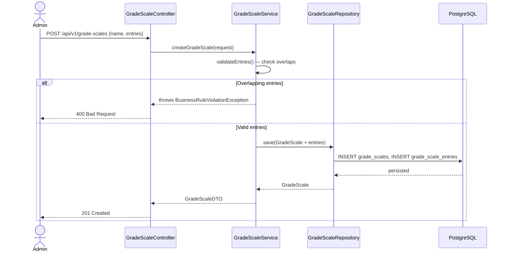
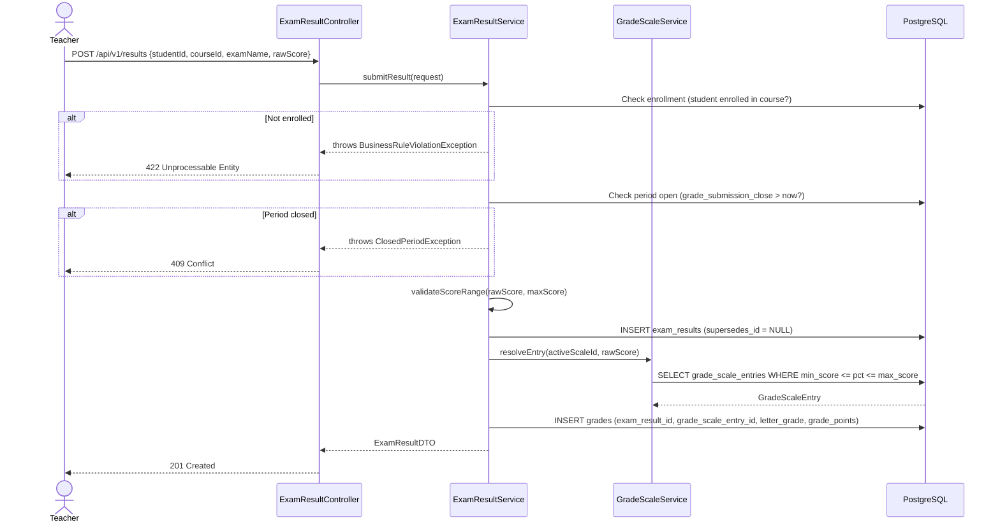
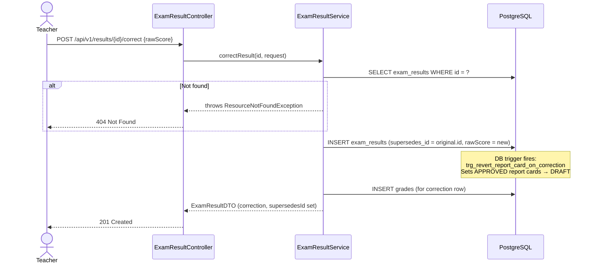
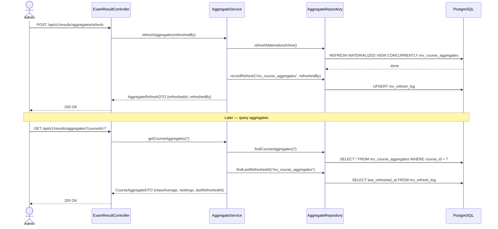
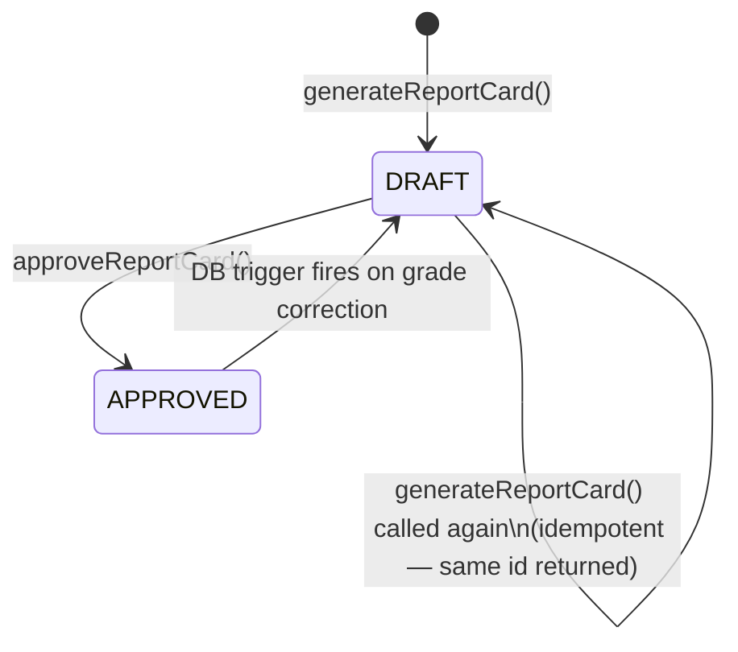
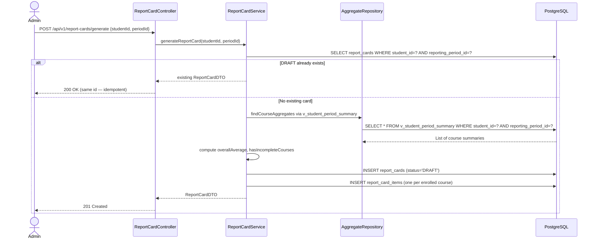

# Workflows — School Management Portal (Database & Results Domain)

---

## Workflow 1 — Administrator Creates a Grade Scale



**Key rule**: Entries are validated for non-overlapping `(min_score, max_score)` ranges before any insert. A grade scale entry cannot be deleted once any `grades` row references it.

---

## Workflow 2 — Teacher Submits an Exam Result



---

## Workflow 3 — Teacher Corrects an Exam Result



**Immutability guarantee**: The original `exam_results` row is never modified. The view `v_active_exam_results` automatically excludes it (the correction row references it via `supersedes_id`).

---

## Workflow 4 — Aggregate Refresh and Query



**Important**: Refreshing the materialized view is **always explicit**. A grade correction does **not** automatically refresh `mv_course_aggregates`. The `lastRefreshedAt` timestamp reflects only explicit refresh calls.

---

## Workflow 5 — Report Card Generation and Approval Lifecycle



### Detailed Generation Flow



### Approval and Auto-Revert

1. **Approve**: `POST /api/v1/report-cards/{id}/approve` → status `DRAFT → APPROVED`, `approved_at` and `approved_by` set.
2. **Auto-revert**: When a teacher submits a grade correction for a student whose report card is `APPROVED`, the PostgreSQL trigger `trg_revert_report_card_on_correction` fires on the `exam_results` INSERT and sets `status = 'DRAFT'`, clears `approved_at`/`approved_by`. No application code is involved in the revert.
3. **Idempotency**: `(student_id, reporting_period_id)` UNIQUE constraint on `report_cards` prevents duplicate rows. The service returns the existing DRAFT rather than inserting a new one.

---

## Workflow 6 — Schema Migration

```mermaid
flowchart TD
    A[Developer writes V{n+1}__description.sql] --> B[Test against clean Docker DB]
    B --> C{All migrations succeed?}
    C -- No --> D[Fix migration script]
    D --> B
    C -- Yes --> E[Regenerate ERD with SchemaSpy]
    E --> F[Update JPA entity with new column]
    F --> G[Run full test suite — mvnw verify]
    G --> H{Coverage ≥ 80%?}
    H -- No --> I[Add missing tests]
    I --> G
    H -- Yes --> J[Open PR with migration + ERD + entity update]
    J --> K[Reviewer confirms schema constraints match entity annotations]
    K --> L[Merge]
```

**Rules**:
- Never edit a committed `V__` script — Flyway checksum validation will reject it.
- `R__` scripts (views, triggers) can be updated; their checksum updates on re-run.
- ERD must be regenerated in the same PR as every `V__` migration (SC-009).
- Safe NOT NULL addition: `ALTER TABLE ... ADD COLUMN col TYPE NOT NULL DEFAULT value` — the DEFAULT backfills existing rows atomically.
